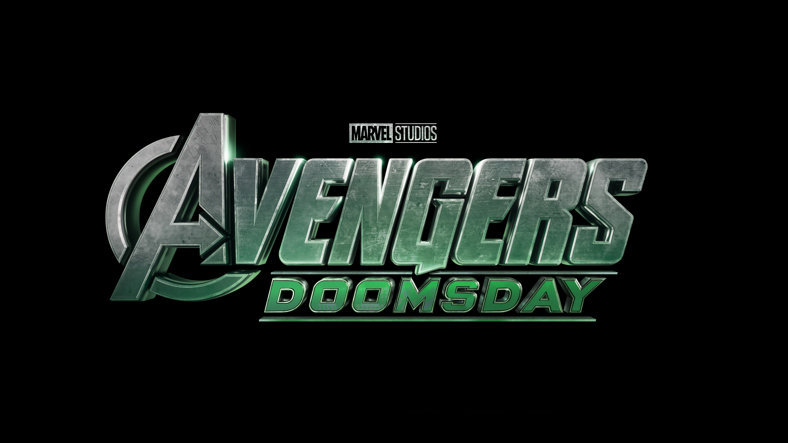

# Smart Watch Glass UI ⌚✨

A modern **Glassmorphism Smart Watch UI** built using **HTML, CSS, and JavaScript**.  
This project displays real-time **date and time** using the **Internationalization API (`Intl.DateTimeFormat`)** for accurate locale-based formatting.

## 🔥 Features

- Glassmorphism UI with blur & transparency
- Real-time clock (HH:MM:SS with AM/PM)
- Dynamic date & weekday display
- Uses `Intl.DateTimeFormat` (modern JS approach)
- Responsive & clean UI design
- Avengers-themed cinematic background

## 🛠️ Tech Stack

- HTML5
- CSS3 (Glassmorphism, Flexbox)
- JavaScript (ES6+)
- Intl Date & Time API

## 📸 Preview

## 🚀 Live Demo

> (Optional) Add GitHub Pages link here

## 📂 Project Structure

smart-watch-glass-ui/
│── index.html
│── style.css
│── script.js
│── images/

## 💡 Learning Outcome

- Learned modern date & time formatting using `Intl.DateTimeFormat`
- Improved UI aesthetics with glassmorphism
- Clean DOM manipulation & structured JS code

## 📌 Author

**Tafajjul (Taffu)**  
Frontend / JavaScript Learner 🚀
