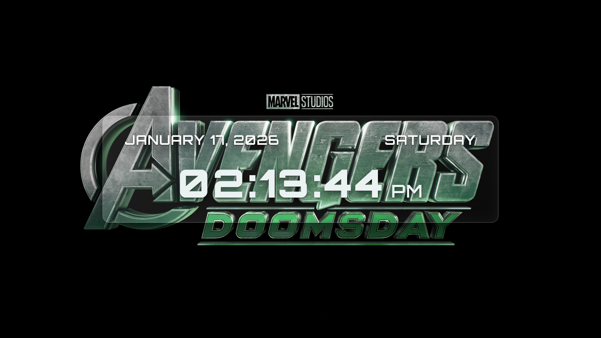

<h1 align="center">⌚ Smart Watch Glass UI</h1>

<p align="center">
  A modern <b>Glassmorphism Smart Watch UI</b> built using <b>HTML, CSS, and Vanilla JavaScript</b>.<br/>
  Displays real-time <b>date & time</b> using <code>Intl.DateTimeFormat</code> for accurate locale formatting.
</p>

<p align="center">
  
  
  
  
</p>

---

## 📸 Preview

<p align="center">
  
</p>

---

## ✨ Features

- Glassmorphism UI (blur + transparency + smooth shadows)
- Real-time clock (HH:MM:SS with AM/PM)
- Dynamic date + weekday display
- Locale-aware formatting using `Intl.DateTimeFormat`
- Clean UI layout & responsive design
- Cinematic Avengers-themed background

---

## 🧠 JavaScript Learnings

This project helped me practice:

- Using `Intl.DateTimeFormat` for modern date/time formatting
- Updating UI in real-time using `setInterval()`
- DOM manipulation with `querySelector()` & `textContent`
- Clean code structuring (separating UI + formatting logic)

---

## 🛠 Tech Stack

- HTML5
- CSS3 (Glassmorphism, Flexbox)
- JavaScript (ES6+)
- Intl Date & Time API

---

## 🚀 Live Demo

👉 https://github.com/taffuwebx09/smart-watch-glass-ui

---

## 📂 Project Structure

```bash
smart-watch-glass-ui/
│
├── index.html
├── README.md
│
├── assets/
│   └── preview.png
│
├── css/
│   └── style.css
│
├── js/
│   └── script.js
│
└── images/
    └── background.jpg

🔮 Future Improvements

Add multiple watch themes (Light / Dark / Neon)

Add timezone selector

Add weather widget (API based)

Smooth animation while time changes

👨‍💻 Author

Tafajjul
```
